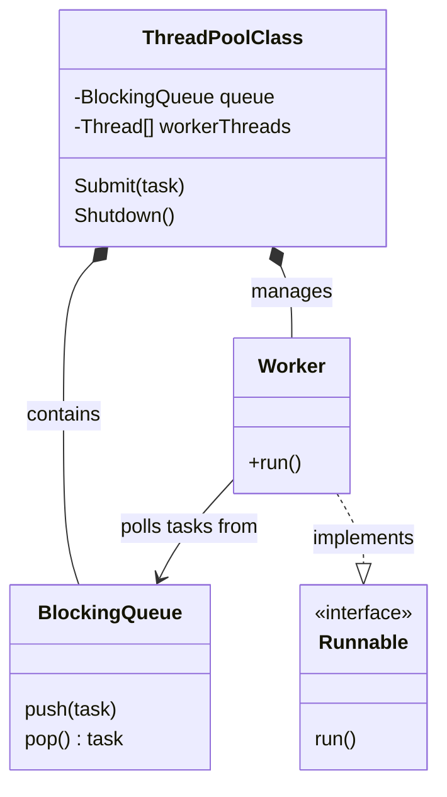

```mermaid
classDiagram
    class ThreadPoolClass {
        -BlockingQueue queue
        -Thread[] workerThreads
        Submit(task)
        Shutdown()
    }
    
    class BlockingQueue {
        push(task)
        pop() task
    }
    
    class Worker {
        +run()
    }
    
    class Runnable {
        <<interface>>
        run()
    }

    ThreadPoolClass *-- BlockingQueue : contains
    ThreadPoolClass *-- Worker : manages
    Worker ..|> Runnable : implements
    Worker --> BlockingQueue : polls tasks from
```