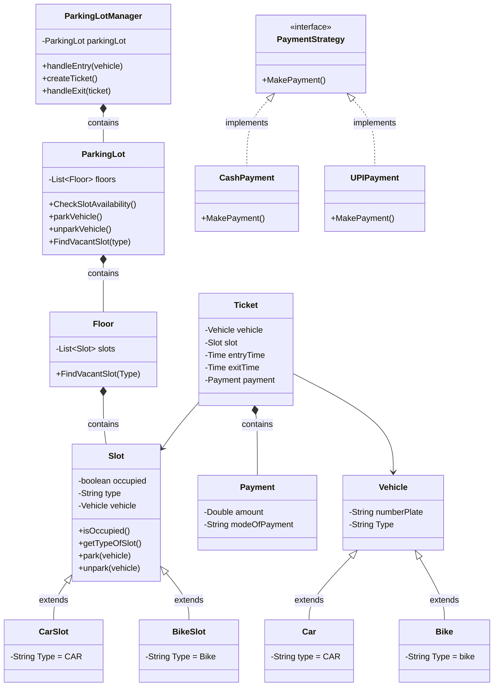

# Parking Lot Design

## User Flow

1. User enters the parking
2. Availability check, if full deny entry else proceed further
3. Parking checks the requirement of user if it is bike or car
4. Based on requirement parking generates ticket(which captures entry time, vehicle number assigned slot) and assign the floor and slot to the user
5. Vehicle is parked
6. After sometime user want to exit so shares the ticket
7. Parking tell the price to user based on ticket
8. User pays the amount
9. Takes exit and that slot is vacant now

## Core Entities

- Vehicle
- Parking Lot
- Floors
- Parking Slot
- Ticket
- Parking Lot Manager
- Payment

## Class Diagram

