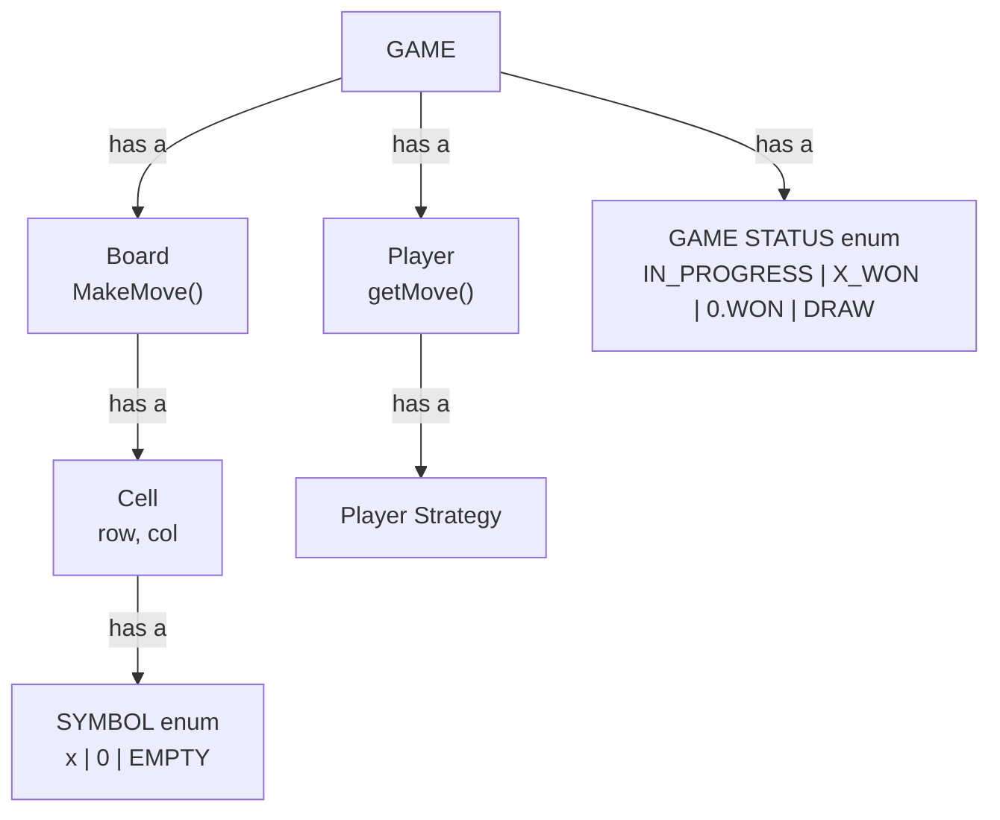

```mermaid 
flowchart TD
    GAME["GAME"]
    Board["Board\nMakeMove()"]
    Player["Player\ngetMove()"]
    Cell["Cell\nrow, col"]
    PlayerStrategy["Player Strategy"]
    Symbol["SYMBOL enum\nx | 0 | EMPTY"]
    GameStatus["GAME STATUS enum\nIN_PROGRESS | X_WON | 0.WON | DRAW"]
    
    GAME -->|has a| Board
    GAME -->|has a| Player
    GAME -->|has a| GameStatus
    Board -->|has a| Cell
    Player -->|has a| PlayerStrategy
    Cell -->|has a| Symbol
```